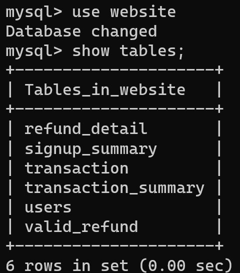

# DataPipe

DataPipe is a project that implements three ETL (Extract, Transform, Load) pipelines for processing dynamic data which is been generating dynamically from an e-commerce website.

In this project a advanced library named "generate_data_library" is created to generate data which is almost similar to that of generated by a ecommerce website.

## SQL Database Schema
**Database Name:** website

### The `website` database consists of the following tables:
</img>

## CSV Dataset Containing Products Information
**Name of the CSV file:** products_table.csv  
**Location of the CSV file:** ["products_table.csv"](dataset/product_table.csv)

## Dynamic Data Generation

This project utilizes dynamic data, which closely resembles to real-world data generated by an e-commerce website. To generate live data for testing and development purposes, an advanced library [`generate_data_library`](generate_data_library) is used.

### Features of `generate_data_library`:
- Generates realistic user signup data, transaction data, and refund request data.
- Offers configurable parameters such as the number of users, transaction frequency, refund request patterns, etc.
- Provides flexibility to customize the data generation process to simulate various scenarios.

### Steps to generate data useing `generate_data_library`:
1. Run the jupyter Notebook [`Generate_all_data.ipynb`](Generate_all_data.ipynb) to stat generating the data.
2. This jupyter Notebook is using the library `generate_data_library` and with the help of threading it is able to generate User's data, Transaction Data and Refund Data simultaneously.

## Pipelines to peform ETL (Extract, Transform, Load) on the Data.

### Pipeline 1: User Signup Summary

</img>

This pipeline focuses on summarizing user signup data from the e-commerce website. It extracts relevant information, transforms it into a meaningful format, and loads it for further analysis and reporting.

### Components and Steps:
#### 1. Extraction: 
   - Retrieve user signup data from the e-commerce website's database or relevant data sources.
   #### "users" table schema
   

#### 2. Transformation: 
   - Perform data cleaning and preprocessing.
   - Apply aggregations or calculations to derive meaningful insights.
   - Generate a summarized view of the user signup data.
   #### Transformed Data
   

#### 3. Load: 
   - Store the processed and summarized data in a suitable format (e.g., a database, CSV file, or data warehouse).
   - Ensure appropriate indexing or organization for efficient retrieval and analysis.

